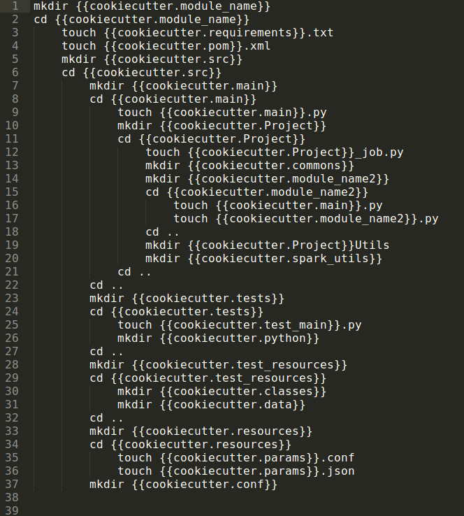
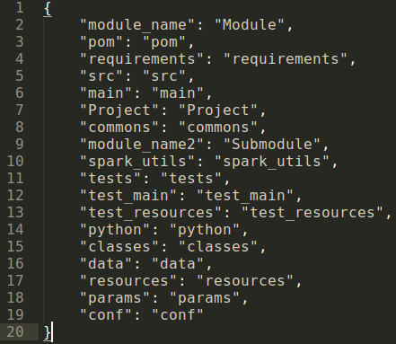
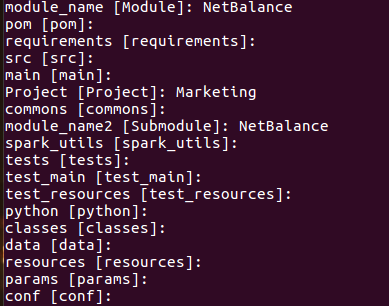
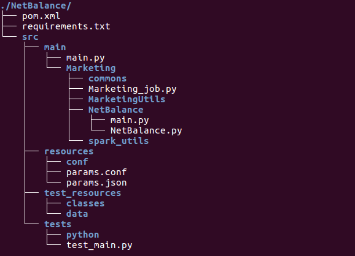

# How_to_make_and_use_a_cookiecutter_template
step by step on how to make and use a cookiecutter template for python packages

# Before to start

Before trying this, you may want to do a simpler example. The one in: http://cookiecutter.readthedocs.io/en/latest/first_steps.html
is clear and easy and maybe better suited for learning prupose. 

# Now that you have tried (or not) something clear and simple...

## Requirements
* Linux or unix
* [Install python] (https://www.python.org/)
* Install cookiecutter: 
```python
$ pip install cookiecutter
```
## Resources
Two files are being provided you to use this template:
* cookiecutter.json : dictionary with the default names used for the cookie cutter
* cookie_cuter_for_ModuleAnalytics1 : structure of the template

The latter contains a list of all the directories and files to be created as shown below:



And the first one a json where all the names that follow the word *cookiecutter* in *cookie_cuter_for_ModuleAnalytics1* can be found. That json will provide a default with names for the "cookiecutter.something" names between brackets in the template.

## Making a template

The template provided here is quite sturdy. You can make simpler ones considering:
* All the words in brackets that follow **cookiecutter.** can be modified and changed for names that you choose once you create your backbone directories from the template.
* **mkdir {{cookiecutter.name}}**: creates a new directory which you can name as you want once you run cookiecutter
* **touch {{cookiecutter.name}}.txt**: creates a file which you can name as you want once you run cookiecutter. The file can have any extension that you prefer and may have some default contets as in http://cookiecutter.readthedocs.io/en/latest/first_steps.html which can also contain brackets to customize packages o words with cookiecutter.

Ideally a template will consider all the folders and files that are a most in a series of projects that you will be workingon constantly. you can add any new folders and files not considered in the basic template further during the development of your project.

## Steps to follow

### 1. Define the main folders and files used in the projects or series of projects where your template will be involved. Drawing a diagram may be useful.
### 3. Make a folder with the name of your template
```
mkdir ModuleAnalytics1
```
### 2. Write down (as in cookie_cuter_for_ModuleAnalytics1) the instructions to create the basic files and folders for your project. Bear in mind that if you want a name to be constant, you can leave a default in the json file for that name.

### 3. Write down the cookiecutter.json file with the defaults for the names that you have already stated in your template and save it in the folder named as your template.  

### 4. Run the instructions that you made in 2 (ex. cookie_cuter_for_ModuleAnalytics1) inside the folder named as your template.
At this point you already have a cookiecutter template!!! To test it lets fllow the next steps:
### 5. Make a new directory where you want to create the packag or project contained in the template.
```
mkdir here_goes_my_project
```
### 6. In that directory run cookiecutter indicating the directory where your template is located.

```
cookiecutter ../ModuleAnalytics1/
```
### 7. A menu will be displayed where you can choose the new names that you want to give to your folders and files (if you press return or enter the default value will be used).

### 8. If everything went ok, nothing will be notified and you will get your new template based struture. Otherwise you may get a message as the followng: 
```
Unable to create directory '../../fakeone/NetBalnce/{{cookiecutter.src}}/{{cookiecutter.main}}/{{cookiecutter.Project}}/{{cookiecutter.module_name2}}Utils'
Error message: 'dict object' has no attribute 'module_name2'
Context: {
    "cookiecutter": {
        "Project": "Project", 
        "Project_job": "Project_job", 
        "_template": "../ModuleAnalytics1/", 
        "classes": "classes", 
        "commons": "commons", 
        "conf": "conf", 
        "data": "data", 
        "main": "main", 
        "module_name": "NetBalnce", 
        "module_name3": "Submodule", 
        "params": "params", 
        "pom": "pom", 
        "python": "python", 
        "requirements": "requirements", 
        "resources": "resources", 
        "spark_utils": "spark_utils", 
        "src": "src", 
        "test_main": "test_main", 
        "test_resources": "test_resources", 
        "tests": "tests"
    }
```
Which means that you need to solve a directory or file name that may be missing in the json file.
### 9. Supposing tha you no longer get any output messages, just run tree, along with the name of the directory where you just created your package to check its integrity.
```
tree ./NetBalance
```


